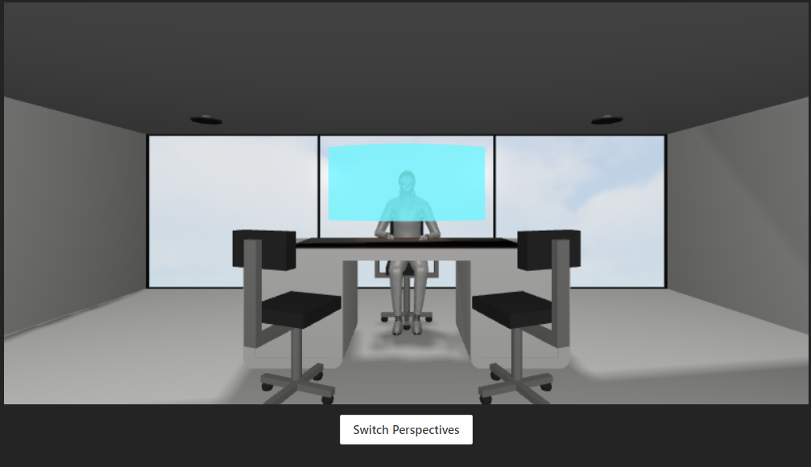
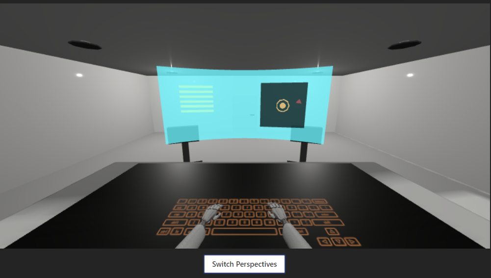

# Office_World

Framework: Three.js
Class: CSE 160 Intro to Computer Graphics

In this project, I made a simple 3d environment of a modern looking office with primitive 3D objects and a custom made 3D model of a robot ceo, modelled and textured in Blender and Adobe Substance 3d Painter.

